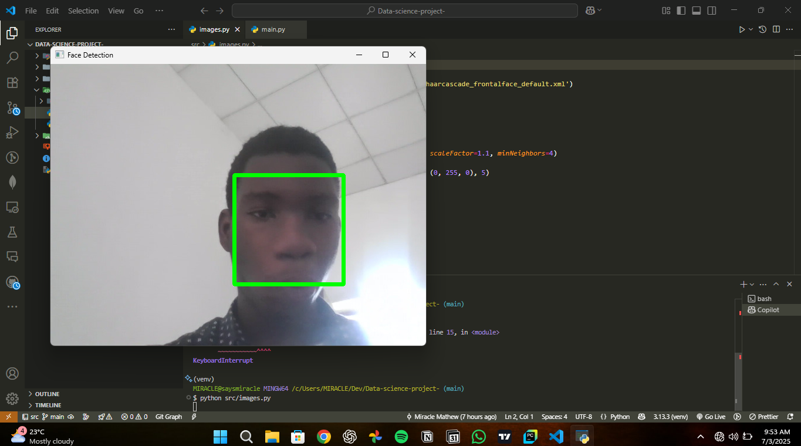

# Computer Vision Project: Face Detection and Recognition

This repository hosts a computer vision project focused on face detection and recognition using OpenCV in a Python environment. It is set up to leverage common data science and image processing libraries for tasks such as:

- Detecting faces in images or video streams.
- Potentially recognizing known individuals.
- Analyzing facial features (though specific implementations are not yet present).

The project uses libraries like `opencv-python`, `numpy`, and `matplotlib`, and is suitable for development within Jupyter notebooks for interactive exploration and visualization.

## Installation

Provide instructions on how to install any necessary dependencies or set up the environment. For example:

```bash
pip install -r requirements.txt
```

## Usage

Explain how to run the code or use the project.

This project is designed to be used with Python and OpenCV, preferably within a Jupyter Notebook environment for interactive development and visualization.

**Example Workflow:**

1.  **Set up your environment:** Ensure you have Python and the dependencies from `requirements.txt` installed.
2.  **Launch JupyterLab or Jupyter Notebook:**
    ```bash
    jupyter lab
    # or
    jupyter notebook
    ```
3.  **Create a new notebook (or use existing ones if added later):**
    - Import necessary libraries (e.g., `cv2`, `numpy`, `matplotlib.pyplot`).
    - Load images or video streams.
    - Utilize OpenCV functions for face detection. The Haar cascade file `Datasets/haarcascade_frontalface_default.xml` is provided and can be used with `cv2.CascadeClassifier`.
    - Display results using `matplotlib` or OpenCV's display functions.

**Face Detection Example Snippet (Conceptual):**

```python
import cv2
import matplotlib.pyplot as plt

# Load the Haar cascade for face detection
face_cascade = cv2.CascadeClassifier('Datasets/haarcascade_frontalface_default.xml')

# Load an image
img = cv2.imread('path/to/your/image.jpg') # Replace with an actual image path
gray_img = cv2.cvtColor(img, cv2.COLOR_BGR2GRAY)

# Detect faces
faces = face_cascade.detectMultiScale(gray_img, scaleFactor=1.1, minNeighbors=5)

# Draw rectangles around the faces
for (x, y, w, h) in faces:
    cv2.rectangle(img, (x, y), (x+w, y+h), (255, 0, 0), 2)

# Display the image (if using matplotlib in a notebook)
plt.imshow(cv2.cvtColor(img, cv2.COLOR_BGR2RGB))
plt.show()
```

Further development could involve adding scripts for specific tasks or more complex image processing pipelines.

## Contributing

Detail how others can contribute to this project. This might include:

- Coding standards.
- How to submit bug reports or feature requests.
- The process for submitting pull requests.
```

## Project Showcase

Below is an image demonstrating an example of the face detection capabilities discussed:

